  

<h1 align="center">Hi 👋, I'm An (Dang Nguyen Minh An)</h1>
<h3 align="center">Full-Stack Software Engineer | AI-assisted Development | Master's Student in AI-oriented Software Engineering</h3>

  

- 🎓 **Education**: Pursuing a Master's in AI-oriented Software Engineering at **FPT School of Business and Technology (FSB)**
- 💼 **Experience**: 2+ years building and maintaining production web applications (including internship), from an enterprise platform used by **VietJet Air** to end-to-end freelance products
- 🧩 **What I do**: Turn business requirements into working software across responsive UIs, RESTful APIs, databases, and deployed systems, and ship them with AI-assisted workflows
- 🚀 **Current focus**: A hotel rate intelligence and forecasting platform (crawling pipeline + ML), and building products faster with AI while keeping the output verified
- 🛠️ **Core stack**: **TypeScript, React.js, Next.js, Node.js, Tailwind CSS, MySQL, MongoDB**, plus Python/FastAPI for data and ML work
- 📍 **Location**: Ho Chi Minh City, Vietnam
- 📧 **Contact**: [dangnguyenminhan.working@gmail.com](mailto:dangnguyenminhan.working@gmail.com)

---

### 🤖 How I build with AI

- **Builder and reviewer are different models.** One model implements; an independent second model audits the design, code and behaviour, so I am not relying on a single model checking its own work.
- **Evidence over claims.** Reviews must run against real data and real tests. A "done" or "PASS" is only accepted after it is re-verified.
- **Independent QA agents.** I hand a self-contained test script to a fresh AI agent with no context of the build, and have it audit the product end to end and report bugs with file and line references.
- **Context kept in the repo.** Conventions, invariants and decisions live in versioned project files, so every session starts from the same rules.
- **Humans remain the final decision-makers.** AI proposes and challenges; I make the final call on trade-offs and what ships.

See it in practice: [capstone-master](https://github.com/Andnm/capstone-master) and [ProjectBlackDiamond](https://github.com/Andnm/ProjectBlackDiamond).

---

### 💼 Work Experience

  
<b>Freelance / Independent</b> | Software Engineer (Sep 2025 - Present)

   
  <ul>
    <li>Deliver a range of end-to-end web products for multiple clients across different domains, from requirements analysis and database design to RESTful APIs and responsive user interfaces.</li>
    <li>Build admin dashboards with JWT authentication, role-based access control, file upload, and searchable, filterable, paginated data tables.</li>
    <li>Ship products with an AI-assisted workflow: one model builds, an independent model reviews and audits behaviour, and findings are checked against real data and a written end-to-end test script before release.</li>
    <li>Own deployment end to end: Docker, Linux VPS provisioning, Nginx reverse proxy, domain/DNS and SSL.</li>
    <li>Maintain deployed systems by debugging production issues, optimizing API endpoints and SQL queries, and improving page-load performance.</li>
    <li><b>Tech Stack:</b> TypeScript, React.js, Next.js, Node.js, Tailwind CSS, MySQL, MongoDB, Docker, Nginx.</li>
  </ul>

  
<b>Digital Age Technology Solutions</b> | Software Engineer (Feb 2025 - Aug 2025)

   
  <ul>
    <li>Built responsive Next.js and TypeScript interfaces for a digital signature platform used by <b>VietJet Air</b>.</li>
    <li>Implemented document upload, multi-step signing, signer assignment, signature placement, status tracking, and user/role management screens.</li>
    <li>Integrated 30+ RESTful API endpoints with authentication, validation, loading/error states, and edge-case handling.</li>
    <li>Wrote and ran test cases, resolved QA-reported bugs, supported production deployment, and optimized large document lists with pagination and memoization.</li>
    <li><b>Tech Stack:</b> TypeScript, Next.js, MySQL.</li>
  </ul>

  
<b>FPT Software - CMS Business Unit</b> | Software Engineer, On-the-job Training (Sep 2022 - Feb 2023)

   
  <ul>
    <li>Developed reservation and customer-management features to detailed specifications from a Japanese client.</li>
    <li>Built reusable data tables, multi-step forms, and modals shared across platform modules.</li>
    <li>Worked in a 150-member project using Git branching, code review, and sprint processes while coordinating with project, technical, and back-end teams.</li>
    <li><b>Tech Stack:</b> TypeScript, React.js, Redux Toolkit, Material UI, MS SQL Server.</li>
  </ul>

---

### 🚀 Featured Projects

  
<b><a href="https://github.com/Andnm/capstone-master">Hotel Rate Intelligence & Forecasting Platform</a></b> | Master's Thesis (In progress)

   
  <ul>
    <li>Built a crash-safe crawling pipeline (MySQL job queue, lease-based claiming, network circuit breaker) around a dual-time-axis data model, running unattended every day across ~354 hotels in 5 cities.</li>
    <li>Collected 1.3M+ price observations; the first warehouse snapshot rebuilds with identical checksums.</li>
    <li>Designed a self-calibrating room and rate-plan matching system that auto-approves comparable inventory from stable attribute fingerprints instead of hand-built mappings.</li>
    <li>Built with a builder/reviewer AI workflow: one model implements, an independent model reviews in written threads, and nothing is signed off until it passes on real data.</li>
    <li>Training Random Forest and XGBoost models, supported by SHAP, to forecast 1/3/7/14-day price movements.</li>
    <li><b>Tech Stack:</b> Python, FastAPI, MySQL, Selenium, Next.js, scikit-learn, XGBoost.</li>
  </ul>

  
<b><a href="https://github.com/Andnm/ProjectBlackDiamond">ProjectBlackDiamond</a></b> | Client project: multilingual luxury-jewellery website with admin CMS (2026) | <a href="https://www.blackdiamondluxury.org/">Live site</a>

   
  <ul>
    <li>Built a 5-language website (Thai, Vietnamese, Lao, Chinese, English) with catalog, blog, membership and newsletter forms, SEO (sitemap, robots) and per-locale currency display updated by a daily scheduled job.</li>
    <li>Built an admin CMS with Supabase authentication, rich-text editing, image storage, and an automatic translation workflow with per-field status and quota tracking.</li>
    <li>Developed with AI assistance and verified before release by an independent AI QA agent that audits the whole site from a written end-to-end test script, under strict rules: report only, evidence for every finding, clean up all test data.</li>
    <li>Live in production for a real client at <a href="https://www.blackdiamondluxury.org/">blackdiamondluxury.org</a>, deployed on Vercel for fast delivery and low running cost.</li>
    <li><b>Tech Stack:</b> Next.js, React, TypeScript, Tailwind CSS, Supabase (PostgreSQL, Auth, RLS), Vercel.</li>
  </ul>

  
<b>Booking Driver App for Intoxicated Passengers</b> | Graduation Capstone (2024)

   
  <ul>
    <li>Developed a Flutter ride-hailing app with real-time driver location, route calculation, live trip tracking, and a complete booking flow.</li>
    <li>Integrated MoMo/VNPay payments, SignalR trip updates, Firebase Authentication, and Agora voice/video calls.</li>
    <li>Built a Next.js admin web application for booking, driver/passenger, system-status, and real-time notification management.</li>
    <li>Collaborated with a .NET, Kafka, PostgreSQL, and MongoDB backend to design APIs and synchronize asynchronous data flows.</li>
    <li><b>Tech Stack:</b> Flutter, Next.js, Google Maps API, SignalR, Firebase, Agora SDK, MoMo/VNPay.</li>
  </ul>

---

### 🛠 Languages and Tools

  
   
  
   
  

---

### 🎓 Education

- **Master - AI-oriented Software Engineering** | FPT School of Business and Technology (FSB), Jan 2025 - Present
- **Bachelor - Software Engineering** | FPT University, Sep 2019 - Dec 2024 | **100% scholarship**

---

### 📈 GitHub Stats

  <table border="0">
    <tr>
      <td width="50%" align="center">
        
      </td>
      <td width="50%" align="center">
        
      </td>
    </tr>
  </table>

---

### 🤝 Connect with me

  
  
  

